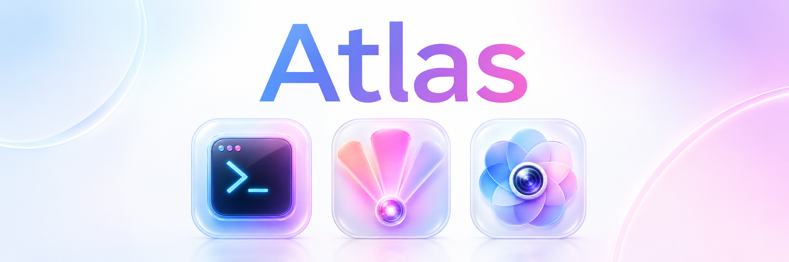

# Atlas — a self-hosted homelab platform

[](https://www.rust-lang.org)
[](https://developer.apple.com/swiftui/)
[](https://www.python.org)
[](https://github.com/pgvector/pgvector)
[](LICENSE)

**Atlas** is everything that runs on or controls a single headless home server:
a Wake-on-LAN Rust CLI for the Mac, a lightweight server agent with a real
terminal in your pocket, a self-built Google Photos + Drive replacement with
local AI search, and a music-synced light-show system driving Philips Hue over
Art-Net. No cloud, no subscriptions — your hardware, your tailnet, your data.

---

## What's inside

| Directory | What it is |
|---|---|
| [`cli/`](cli/) | Rust CLI for the Mac: `atlas` \| `boot` (Wake-on-LAN) \| `shutdown` \| `status` \| `build` \| `dev` \| any remote command |
| [`agent/`](agent/) | `atlas-agent` — dependency-free Rust server (port 8787): metrics, WebSocket PTY terminal, Docker overview, power control, light-show & fog control |
| [`agents/`](agents/) | The atlas agents platform: long-running AI agents on the box — first resident: **hermes** (gateway + WhatsApp bridge, full state migrated from the Mac) |
| [`backend/`](backend/) | The data foundation: Postgres 17 + pgvector in Docker — media library, knowledge graph, embeddings, resumable ingest queue |
| [`apps/atlas-admin/`](apps/atlas-admin/) | iOS app **Atlas** (SwiftUI): dashboard, real terminal, Docker, VPN/exit-node stats, activity heatmap |
| [`apps/atlas-lightshow/`](apps/atlas-lightshow/) | iOS app **Lightshow**: play shows, AI show creation, manual per-light control, hold-to-fog |
| [`apps/atlas-photos/`](apps/atlas-photos/) | iOS app **Storage**: self-hosted Google Photos + Drive — Rust/axum server, SwiftUI client, GPU AI pipeline (faces, semantic photo *and* video search) |
| [`lightshows/`](lightshows/) | Show production: GPU song analysis, dark-gap compiler, AI composer, Art-Net→Hue bridge, fog hardware |
| [`builder/`](builder/) | Pinned Docker build images (Rust→Graviton, Node/Next.js, Flutter) |
| [`scripts/`](scripts/) | Operational tools: Takeout transfer, photo triage UI, embedding-space maps |

## Highlights

- **One command from asleep to shell** — `atlas boot` sends the Wake-on-LAN
  packet, waits for SSH, and drops you in. `atlas shutdown` puts the box back
  to sleep. Idle power is ~0 W because the server only runs when you need it.
- **Your photos, actually yours** — Takeout in, originals content-addressed on
  your disk, thumbnails, EXIF, faces, and 2048-d embeddings for semantic
  search over photos *and* videos. The iOS app does albums, favorites, backup,
  and natural-language search.
- **A terminal in your pocket** — the admin app speaks to the agent's
  WebSocket PTY: a real shell on the server, from the couch.
- **Light shows from a song file** — analysis extracts beats, energy and
  structure; the compiler builds a choreography; the bridge streams it to Hue
  lamps over Art-Net, beat-accurate, with fog.
- **Tailnet-first security** — nothing is port-forwarded. Services are
  reachable only inside your private Tailscale network, with optional bearer
  tokens on top ([security model](docs/SETUP.md#security-model)).

## Quickstart

```bash
# Mac: install the CLI, then configure your machine values
cargo install --path cli
mkdir -p ~/.config/atlas && $EDITOR ~/.config/atlas/env   # see docs/SETUP.md

atlas boot        # wake the server (Wake-on-LAN)
atlas agent       # build + install the metrics/terminal agent
atlas status      # LAN / tailnet reachability

# Server: the database
cd backend/docker && cp .env.example .env && docker compose up -d
```

Full from-scratch setup — hardware, Ubuntu, Tailscale/tailnet, Wake-on-LAN,
CUDA, models, iOS builds: **[docs/SETUP.md](docs/SETUP.md)**

Per-area docs:
[cli](cli/README.md) ·
[agent](agent/README.md) ·
[backend](backend/README.md) ·
[atlas-admin](apps/atlas-admin/README.md) ·
[atlas-lightshow](apps/atlas-lightshow/README.md) ·
[atlas-photos](apps/atlas-photos/README.md) ·
[lightshows](lightshows/README.md) ·
[scripts](scripts/README.md)

## Architecture

```
 Mac ──ssh/WoL──▶ ┌──────────────── server ────────────────┐
 (cli)            │ atlas-agent :8787   photos server :8788│
                  │ Postgres 17 + pgvector (Docker)        │
 iPhone ─tailnet─▶│ GPU pipeline (faces, embeddings)       │
 (3 SwiftUI apps) │ Art-Net→Hue bridge :6454 ──▶ 💡 lights │
                  └────────────────────────────────────────┘
```

Everything meets on your private tailnet; the server sleeps until woken.

> **Note:** docs are English; the CLI output and the three iOS app UIs are
> German (the author's daily drivers). Contributions translating them are welcome.

## License

[MIT](LICENSE) — use it, fork it, build your own.

The MIT license covers the code in this repository. Model weights downloaded
at runtime (e.g. InsightFace `buffalo_l`, non-commercial research license)
keep their own licenses.

## Support

- [Report an issue](https://github.com/luka-loehr/atlas/issues)
- [luka@lukaloehr.com](mailto:luka@lukaloehr.com)

---

Developed by [Luka Löhr](https://github.com/luka-loehr)
