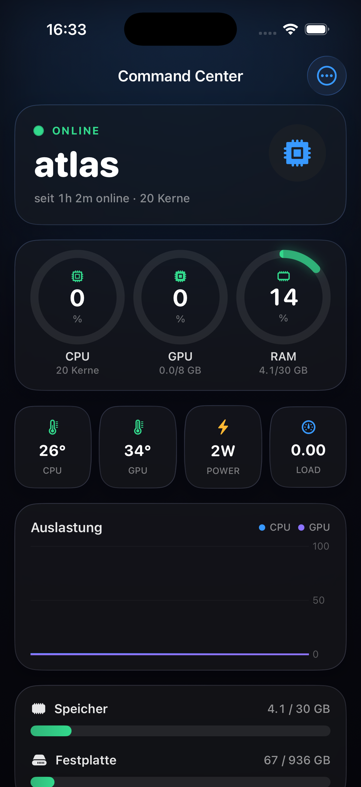
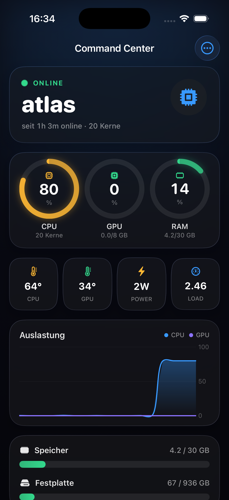

# atlas

Luka's homelab / personal-cloud server — an NZXT box in the corner that does
the heavy lifting: GPU inference, audio analysis, remote builds, agents.

**This repo** is the home for the atlas CLI and every utility that runs *on*
atlas — language models (Ollama), speech-to-text (Whisper), the remote build
tooling, maintenance scripts. It lives at `~/atlas` on the server itself
(deliberately separate from `~/projects`, which holds the app repos).

## What is atlas?

| | |
|---|---|
| Machine | NZXT desktop, built into a headless server (July 2026) |
| CPU | Intel i7-12700K (20 threads) |
| RAM | 31 GB |
| GPU | NVIDIA RTX 4060 Ti 8 GB (+ Intel UHD 770 iGPU) |
| Disk | 936 GB NVMe |
| OS | Ubuntu Server 26.04 LTS ("resolute"), headless |
| User | `luka` (passwordless sudo) |

## Stack (installed & working)

- **NVIDIA driver 595.71.05** (open modules) + **CUDA 13.3** (`nvcc` in PATH)
- **Docker 29.6.2** + compose v5.3.1, NVIDIA Container Toolkit
  (`docker run --gpus all` sees the GPU, rootless works)
- **Tailscale** (tailnet `your-tailnet`, device isolated to Luka's devices)
- Dev essentials: build-essential, gcc 15.2, git 2.53, tmux, btop, uv

## The CLI (`cli/`)

Rust, zero dependencies, installed on the Mac via `cargo install --path cli`
(needs `~/.cargo/bin` on PATH):

```bash
atlas              # SSH into atlas (execs ssh — a real session)
atlas boot         # Wake-on-LAN + waits until SSH is reachable (LAN only)
atlas shutdown     # sudo poweroff + waits until the box is down
atlas restart      # reboot + waits for it to come back
atlas status       # up/down + route (LAN / tailnet)
atlas build        # build THIS project on atlas (needs .atlas-build.toml)
atlas dev          # run its dev server on atlas + public tunnel URL
atlas agent        # build+install the metrics agent (for the iOS app)
atlas <cmd ...>    # run anything remotely: atlas nvidia-smi, atlas htop ...
```

## Remote builds — `atlas build`

Heavy compiles run on atlas' 20 threads; the Mac stays cool and free. A project
opts in with an `.atlas-build.toml` in its root:

```toml
name = dairo-api                              # remote build dir
image = lambda                                # builder: lambda | node | flutter
build = cargo lambda build --release --arm64  # runs inside the container
artifacts = target/lambda                     # rsync'd back to the Mac
```

`atlas build` then: rsyncs the source to atlas → runs `build` inside the pinned
builder container (`builder/<image>/Dockerfile`) → rsyncs `artifacts` back into
the same paths, so `sam deploy` / install steps on the Mac find them as usual.
Outputs (`target`, `.next`, `build`, `node_modules`) live on atlas and persist
between runs (warm builds); the container runs as root and the tree is chowned
back to `luka` so nothing ends up root-owned. Three builders exist today:

| `image` | base | for |
|---|---|---|
| `lambda` | `rust:1` + aarch64 target + cargo-lambda + Zig | AWS Lambda (Graviton) cross-compiles |
| `node`   | `node:22` + cloudflared | Next.js `npm run build` / `dev` |
| `flutter`| `cirruslabs/flutter:stable` | Android APK/AAB builds |

**Cross-compiling, not emulating.** Lambda is ARM64, atlas is x86 — cargo-lambda
+ Zig produce the Graviton binary natively on x86; the container OS never
touches the artifact's ABI. Measured on dairo-api (40 crates → 18 binaries):
Docker cold **4m16s** vs bare-metal-on-atlas cold **4m16s** — Docker adds *zero*
overhead. Warm (nothing changed): **~1s**.

## Live dev on atlas — `atlas dev`

For a Next.js app (`dev = npm run dev`, `port = 3000` in the config):

```bash
atlas dev          # dev server on atlas + a public https://<...>.trycloudflare.com URL
atlas dev logs     # follow the dev-server logs
atlas dev stop     # tear down the dev + tunnel containers
```

The dev server runs in the `node` container with `--network host`; a
**cloudflared quick tunnel** (no account, no config) publishes it. Edit the code
live on atlas (`ssh atlas` → `~/atlas-builds/<name>`) with hot-reload — the Mac
stays cold and free (e.g. for gaming) while the site is reachable from anywhere.

## When atlas wins (and when it doesn't)

Measured, honestly:

| build | Mac (Apple Silicon) | atlas (20 threads, container) |
|---|---|---|
| Lambda / Rust, cold | ~same | **4m16s** (= bare metal) |
| Lambda / Rust, warm | — | **~1s** |
| Flutter APK, cold | 4m04s | 4m36s |
| Flutter APK, warm | **5s** | 2m00s |

atlas shines for **cold builds + offloading** (Mac stays cool/free) and for the
**dev tunnel** (long-running server, Mac cold). For *warm incremental* builds a
local Mac wins — the container tears down each run, so it can't keep a hot
Gradle daemon / JVM the way a local rebuild does. Rule of thumb: offload the
big cold jobs and the always-on dev server; keep tight edit-rebuild loops local.

## Atlas Command Center — iOS app (`ios/`)

A native SwiftUI app (iOS 26, Liquid Glass) showing atlas' live status — CPU /
GPU / RAM / temps / disk / load / docker containers — polled over the Tailnet
from a tiny zero-dependency Rust server, `atlas-agent` (`agent/`), installed as a
systemd service with `atlas agent`. The phone must be on the same tailnet; atlas
is tailnet-isolated (`autogroup:self`) so the metrics endpoint is only reachable
by Luka's own devices. Details + screenshots: [`ios/README.md`](ios/README.md).

<p>
  
  
</p>

## SSH from the Mac

```bash
ssh atlas          # resolves to atlas.your-tailnet.ts.net — works from anywhere
```

Key auth (`~/.ssh/id_ed25519`), Tailscale SSH interception is OFF — plain
sshd. LAN IP: `192.168.1.100` · tailnet IP: `100.x.y.z`.

## Power on / off

`atlas boot` / `atlas shutdown` (see CLI above). Without the CLI:

```bash
# ON — Wake-on-LAN magic packet (same LAN; NIC enp4s0, armed via wol.service):
python3 -c 'import socket;s=socket.socket(socket.AF_INET,socket.SOCK_DGRAM);s.setsockopt(socket.SOL_SOCKET,socket.SO_BROADCAST,1);s.sendto(b"\xff"*6+bytes.fromhex("74563cb19b08")*16,("192.168.1.255",9))'

# ON from outside the LAN: FritzBox MyFRITZ web UI -> "Wake" button
# (Tailscale can't wake a powered-off box)

# OFF:
ssh atlas 'sudo poweroff'
```

## What runs on it right now

- `~/projects/` — working clones of the app repos:
  claimini, dairo-app, ephraim-app, lgka-app, lightshow, orin-app, receipt-ai
- **lightshow**: the Art-Net → Hue Entertainment bridge
  (`bridge/hue_stream.py`, started per session, not a service) and the GPU
  song-analysis env (`analyze/.venv`: torch cu124, librosa, Beat This!)
- **This repo** at `~/atlas`
- Base services: sshd, tailscaled, docker, wol.service

## Planned (the point of this repo)

- **Ollama** — local LLMs on the GPU
- **Whisper** — speech-to-text
- **Remote build CLI** — one command on the Mac, heavy Rust/compile jobs run
  on atlas (sccache-style)
- Maintenance & convenience scripts (health checks, wake/sleep helpers)
