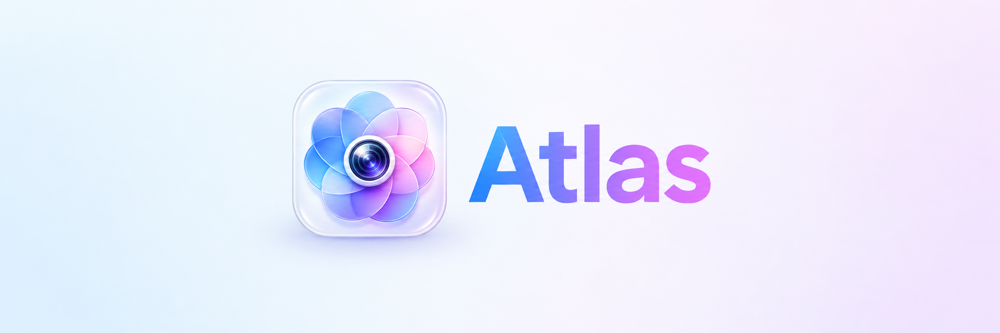

# Atlas – Your photos and files on your own server

[](https://www.rust-lang.org) [](https://developer.apple.com/swiftui/) [](https://github.com/pgvector/pgvector) [](docs/SETUP.md) [](LICENSE)

**Atlas** is a self-hosted photo library and drive for a single home server, with one iOS app in front of it. The backend is Rust end to end; it runs on your own hardware and is reached over a Tailscale tailnet.

---

## Features

- **Photo library** timeline of every photo and video, albums, people, places, favorites, archive, a locked album and a trash
- **Search by content** "dog in the snow" finds it: one embedding model for photos, videos and text, scanned exactly in memory
- **Faces** detection and recognition group photos into people you can name and merge
- **Backup** the iPhone uploads originals, deduplicated by content hash, and can clear backed-up items off the phone
- **Drive** folders over content-addressed files, with previews, full-text search and a trash
- **One app** Fotos, Alben, Dateien and Einstellungen, with live server status, power control and a terminal
- **Built to feel instant** precomputed and compressed timeline, immutable media URLs, streaming uploads, video renditions on the GPU
- **Wake-on-LAN CLI** `atlas boot` wakes the server, `atlas deploy` installs the services, `atlas build` and `atlas dev` build other projects on it
- **Tailnet-first security** one port, firewalled to loopback and the tailnet, one bearer token on every route

---

## Quick start

```bash
# Mac: install the CLI, then configure your machine values (see docs/SETUP.md)
cargo install --path crates/cli
mkdir -p ~/.config/atlas && $EDITOR ~/.config/atlas/env

atlas boot        # wake the server (Wake-on-LAN)

# Server: database, models, configuration
cd ~/atlas/db && cp .env.example .env && docker compose up -d
~/atlas/scripts/atlas/models.sh
sudo install -m600 ~/atlas/scripts/atlas/atlas.env.example /etc/atlas/atlas.env

# Mac again
atlas deploy      # build + install atlas-server and atlas-ml
atlas connect     # the link that connects the app
```

---

## Documentation

- [Overview](docs/OVERVIEW.md): repository layout, architecture, security
- [Setup](docs/SETUP.md): from-scratch machine setup (Ubuntu, Tailscale, Wake-on-LAN, GPU, models, the app)
- Components: [server](crates/server/README.md) · [ml](crates/ml/README.md) · [cli](crates/cli/README.md) · [app](app/README.md) · [db](db/README.md) · [builder](builder/README.md) · [scripts](scripts/README.md)

---

## License

MIT License - [View License](LICENSE)  
Model weights downloaded at setup (Qwen3-VL-Embedding, InsightFace `buffalo_l` with its non-commercial research license) keep their own licenses.

---

## Support

- [Report bugs](https://github.com/luka-loehr/atlas/issues)  
- [luka@lukaloehr.com](mailto:luka@lukaloehr.com)  

---

Developed by [Luka Löhr](https://github.com/luka-loehr)
