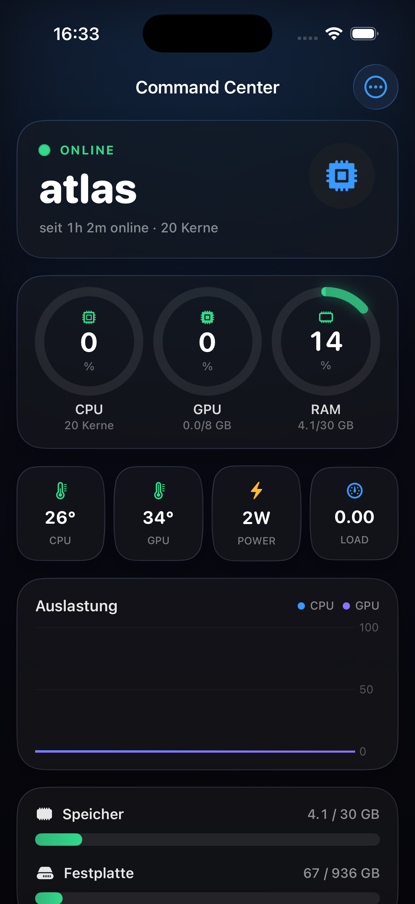
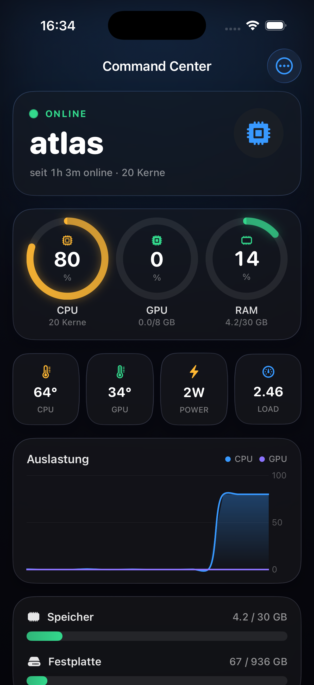

# atlas-admin — Atlas Admin (iOS)

A native SwiftUI iPhone app (iOS 26, Liquid Glass) that is the mobile control
panel for the atlas homelab server. It streams live system metrics — CPU, GPU,
RAM, temperatures, power draw, disk, network, Docker containers — from the
companion Rust API server ([`../../api`](../../api), default port 8787) over a
Tailscale tailnet, and adds an exit-node/AdGuard stats page, a GitHub-style
activity heatmap, a Face-ID-gated PTY terminal (SwiftTerm over WebSocket), and
token-authenticated remote shutdown/restart.

The UI is in German. Lightshow control lives in its own app:
[`../atlas-lightshow`](../atlas-lightshow).

<p>
  
  
</p>

## Tabs

- **Command** — status hero, CPU/GPU/RAM rings, temp/power/load chips, rolling
  60 s CPU+GPU and network charts, memory/disk bars, running containers,
  system info. Toolbar: terminal (top-left), settings and power actions
  (top-right, "⋯" menu).
- **Exit Node** — the server as the tailnet's exit node: animated shield, ads
  blocked and DNS query stats (AdGuard Home), tunnel hours, bytes protected,
  every tailnet peer with rx/tx.
- **"Aktivität"** — contribution heatmap of the server's awake hours
  (reconstructed from the systemd journal) or monorepo commits, plus streak,
  online hours, boots and commits over the last 30 days.

The terminal opens as a full-screen cover and requires Face ID (or the device
passcode) on every open; the WebSocket to the shell is only created after a
successful unlock.

## How it talks to the API server

All traffic is plain HTTP/WebSocket to `http://<host>` inside the tailnet
(see the trust model below). Endpoints used:

| Endpoint | Use |
|---|---|
| `GET /api/metrics` | Full metrics snapshot (2 s poll, fallback + hero data) |
| `GET /ws/metrics` (WebSocket) | Primary live stream: one JSON frame every 500 ms, preceded by a `{"history":[...]}` bootstrap of the server's 10-minute ring buffer so charts are filled instantly |
| `GET /api/vpn` | Exit-node/AdGuard/peers payload (10 s poll) |
| `GET /api/activity` | Per-day online minutes/boots/commits |
| `POST /api/power/shutdown`, `POST /api/power/restart` | Power actions (confirmation alert in the app) |
| `GET /term` (WebSocket) | PTY: binary frames are terminal I/O, resize is sent as a text frame `{"resize":{"cols":C,"rows":R}}` |

Chart samples are smoothed with an EMA (α = 0.30); network rates are derived
client-side from the server's cumulative rx/tx byte counters. While the socket
is down the app falls back to the 2 s HTTP poll and reconnects with a 2 s
backoff.

The token (if set) is sent as an `Authorization: Bearer` header on HTTP
requests. The two WebSockets differ: `/ws/metrics` sends the token both as a
Bearer header and as a `?token=` query parameter, `/term` sends the query
parameter only.

## Build & run

Requirements: macOS with Xcode 26+ (the code uses iOS 26 APIs — `.glassEffect`,
`.buttonStyle(.glassProminent)`, `Tab(value:)`, Swift Charts), an iPhone on
iOS 26.0+ (the target is iPhone-only, portrait), and an Apple Developer team
for signing. The API server must be running on the server — see
[`../../api`](../../api) and [docs/SETUP.md](../../docs/SETUP.md)
for the machine/Tailscale setup.

```bash
cd ios
open AtlasAdmin.xcodeproj     # the generated project is committed
```

The project is generated with [XcodeGen](https://github.com/yonaskolb/XcodeGen)
from `project.yml`; regenerate only after editing the spec:

```bash
brew install xcodegen
xcodegen generate
```

In Xcode: select your iPhone as the destination, then **enable signing** — the
committed project ships with `CODE_SIGNING_ALLOWED = NO` and no team, so you
must actively turn signing on, pick your team, and typically change the bundle
id (`com.lukaloehr.AtlasAdmin`). Make those changes in `project.yml` if they
should survive: `xcodegen generate` overwrites the project file and discards
Xcode-local edits. SwiftTerm (1.14.0) resolves via SPM on first build.

On first launch the settings sheet opens automatically: enter the API host
(e.g. `atlas.your-tailnet.ts.net:8787`) and, if the server runs with a token,
the token. The iPhone must be on the same tailnet as the server.

## Configuration

The app has no config files; everything lives in the in-app settings
("⋯ → Einstellungen") plus one debug hook:

| Setting | Default | Purpose |
|---|---|---|
| Host (`@AppStorage "atlas.host"`) | empty (settings sheet opens on first launch) | API address as `host:port`, e.g. `atlas.your-tailnet.ts.net:8787` |
| Token (`@AppStorage "atlas.token"`) | empty | Bearer token; must match the server's `ATLAS_API_TOKEN` |
| `ATLAS_TAB` (Xcode scheme env var) | `0` | Startup tab override: `0` Command, `1` Exit Node, `2` "Aktivität" |

Server-side configuration (`ATLAS_API_TOKEN`, `ATLAS_API_PORT`,
`ATLAS_API_BIND`, `ATLAS_API_OPEN`) is documented in
[`../../api`](../../api).

## Security model

- **Transport** is plain HTTP/WS with an App Transport Security exception for
  `ts.net` (declared in `project.yml`, baked into `Sources/Info.plist`).
  Inside a tailnet this rides on WireGuard encryption; if the API server is not
  reachable under a `*.ts.net` name you need your own ATS exception.
- **Auth** is enforced by the server, not the app: with `ATLAS_API_TOKEN` set
  every request needs the token; without one, reads are open but power actions
  and the terminal are refused unless the server explicitly runs with
  `ATLAS_API_OPEN=1`. Anyone who can reach the server can do whatever its
  auth mode allows — restrict reachability with your tailnet ACL
  (e.g. `autogroup:self`).
- The **Face ID gate** on the terminal only locks the phone's UI. It is not
  server-side security; that is the API token.
- The token is stored in `UserDefaults` (not the Keychain) and appears as a
  URL query parameter on the WebSocket URLs — use a dedicated token, not a
  shared secret.

## Layout

```
ios/
  project.yml              XcodeGen spec (bundle id, iOS 26 target, SwiftTerm,
                           Info.plist properties); the .xcodeproj it generates
                           is committed too
  Sources/
    App/                   AtlasAdminApp: @main + RootView (3 tabs, settings
                           sheet, PowerAction)
    Model/                 Metrics (Codable mirror of /api/metrics), AtlasClient
                           (URLSession wrapper), DashboardModel (WS stream +
                           poll fallback, EMA, net rates), VPNModel,
                           ActivityModel, Biometric (Face ID)
    Views/                 DashboardScreen, VPNScreen, ActivityScreen,
                           TerminalScreen (SwiftTerm bridge), SettingsScreen;
                           Theme + GlassCard, Components (RingGauge, StatChip,
                           UsageBar, SectionLabel), StatusHero, ContainersCard,
                           LoadChart + NetChart + ChartLive (Swift Charts,
                           live-interpolated)
```

### Naming

One convention, applied everywhere in this app: a type is named `*Screen` when
it owns a `NavigationStack` and is something the user navigates to — the three
tabs, the terminal cover and the settings sheet. Everything else is a
component and carries a plain descriptive name with no `View` or `Screen`
suffix (`StatusHero`, `ContainersCard`, `LoadChart`, `RingGauge`, …). Each
screen lives in one file together with the components only it uses.
